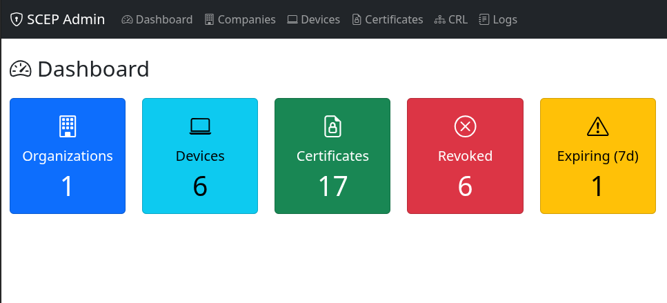
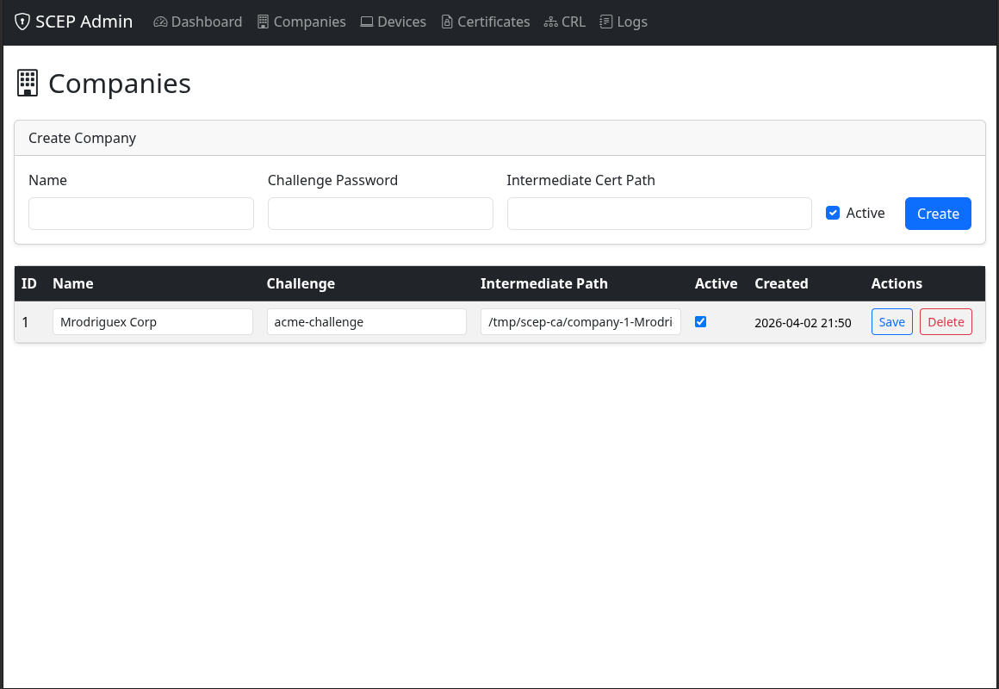
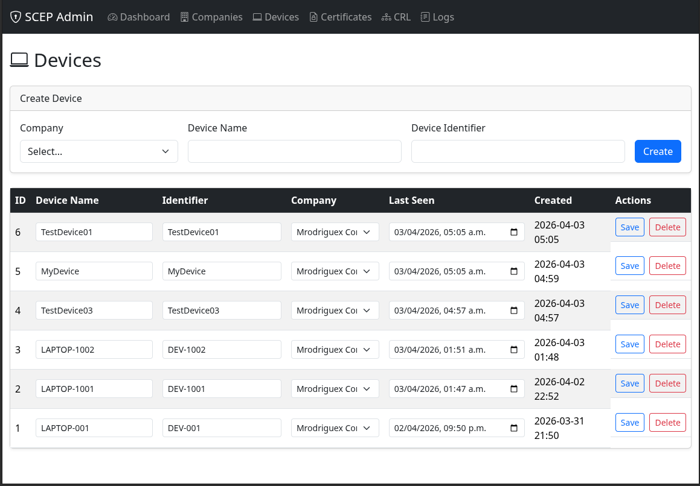
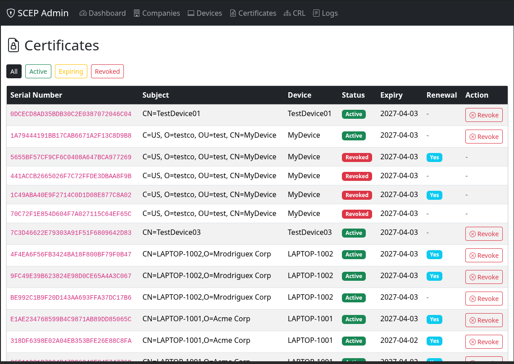
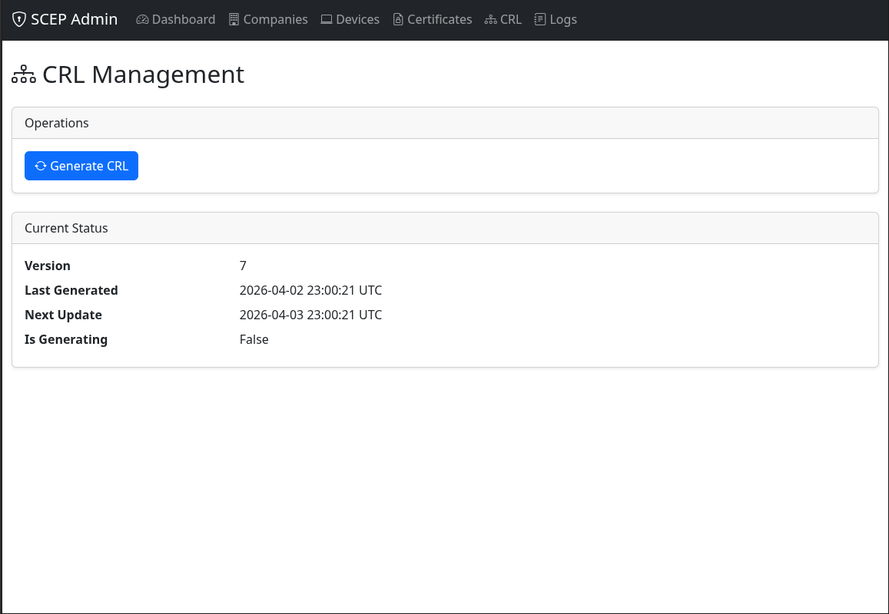
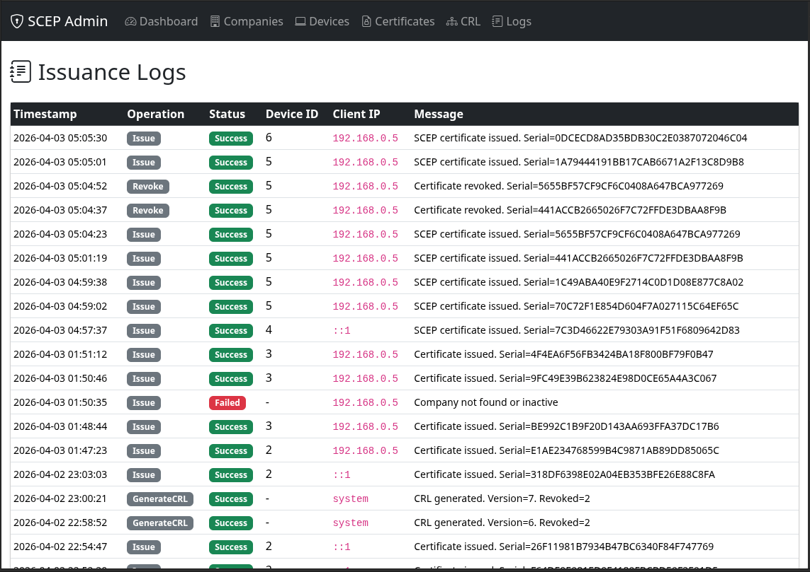
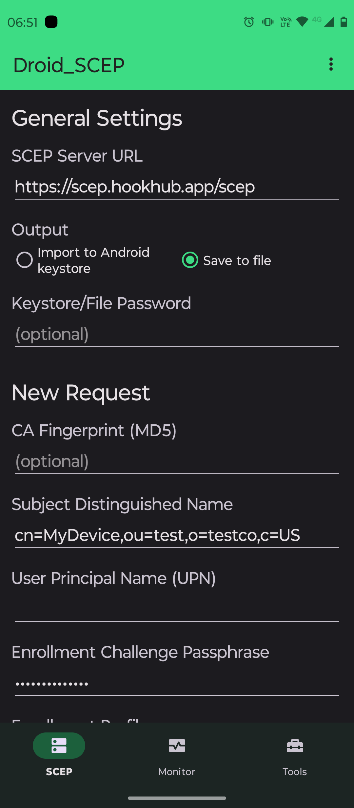
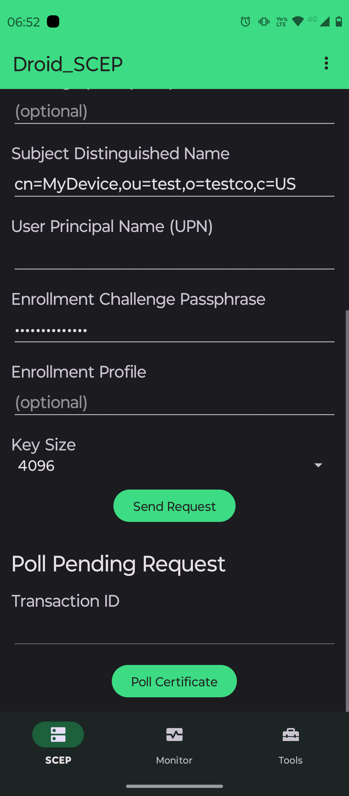
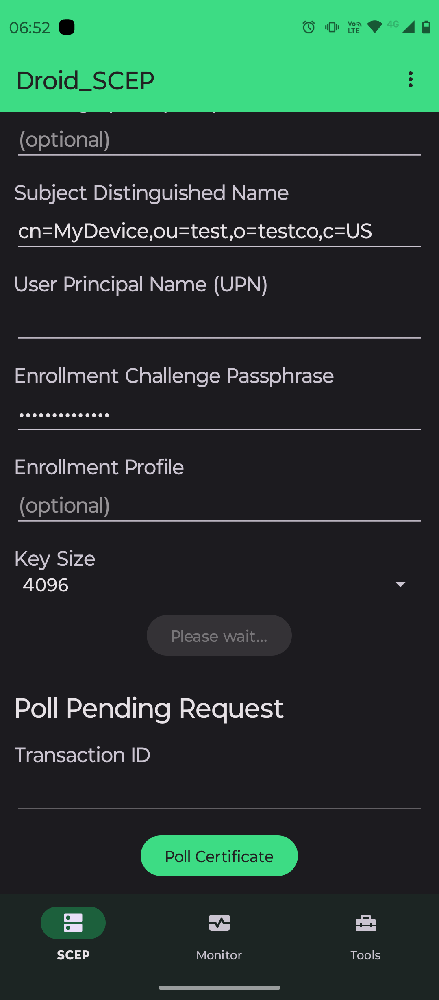
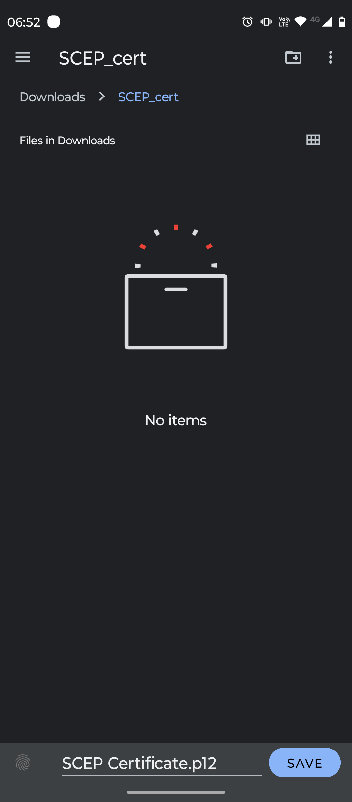

# ScepServer

## Description

ScepServer is a modern, production-ready implementation of a Simple Certificate Enrollment Protocol (SCEP) server and administration portal. It enables automated certificate issuance, renewal, and revocation for managed devices, supporting secure PKI workflows in enterprise environments. The solution addresses the need for scalable, auditable certificate management, integrating with device fleets, MDM systems, and custom automation.

## Features

- Standards-compliant SCEP protocol (RFC 8894)
- Automated certificate issuance, renewal, and revocation
- Certificate Revocation List (CRL) generation and status tracking
- Multi-tenant/company support
- Device enrollment and management
- Audit logging for all certificate operations
- RESTful API endpoints for admin operations
- Demo data seeding for development/testing
- Extensible, clean architecture with SOLID principles
- Built with .NET 8, ASP.NET Core, and Entity Framework Core

## Tech Stack

- **Backend:** .NET 8, ASP.NET Core, Entity Framework Core
- **Database:** SQLite (default, can be swapped for SQL Server/PostgreSQL)
- **Cryptography:** BouncyCastle (X.509, PKCS#10, PKCS#7)
- **Frontend:** Razor Pages (for admin UI)
- **Other:** Dependency Injection, Logging (Microsoft.Extensions.Logging)

## Installation

1. **Clone the repository:**
	 ```bash
	 git clone https://github.com/mrodriguex/ScepServer.git
	 cd ScepServer/ScepServer
	 ```

2. **Configure the environment:**
	 - Copy `appsettings.Development.json` or `appsettings.json` and adjust as needed.
	 - Ensure the CA certificate and private key are available (see Configuration).

3. **Restore dependencies:**
	 ```bash
	 dotnet restore
	 ```

4. **Apply database migrations:**
	 ```bash
	 dotnet ef database update --project ScepAdmin
	 ```

5. **Run the application:**
	 ```bash
	 dotnet run --project ScepAdmin
	 ```


## Live Demo

A probe version is published at: [https://scep.hookhub.app/](https://scep.hookhub.app/)

---

## Usage

### Admin UI

- Access the web UI at `https://localhost:5001/`
- Manage companies, devices, certificates, and view logs.

#### Admin UI Screenshots
<p align="center" style="margin-bottom:2rem;">
	
	
	
	
	
	
</p>

### SCEP Endpoints

- **Enroll Certificate:**  
	`POST /scep/pkiclient.exe`  
	(SCEP clients interact via standard SCEP protocol.)

- **Admin API Examples:**

	- **Revoke Certificate**
		```
		POST /api/operations/revoke
		Content-Type: application/json

		{
			"serialNumber": "0123456789ABCDEF",
			"reason": "Key compromise"
		}
		```
		**Response:**
		```json
		{
			"success": true,
			"message": "Certificate revoked.",
			"certificateId": 42,
			"serialNumber": "0123456789ABCDEF"
		}
		```

	- **Generate CRL**
		```
		POST /api/operations/crl/generate
		```

	- **Get CRL Status**
		```
		GET /api/operations/crl/status
		```


## Configuration

- **CA Certificate:**  
	Place your CA certificate and private key in a secure location.  
	Configure the path and password in `appsettings.json`:

	```json
	{
		"Scep": {
			"CaPath": "path/to/ca.pfx",
			"Password": "your-ca-password"
		}
	}
	```

- **Database:**  
	Default is SQLite. Change the connection string in `appsettings.json` as needed.

- **Environment Variables:**  
	You may override any appsettings value with environment variables using the ASP.NET Core conventions.

## Project Structure

```
ScepAdmin/
	Controllers/    // API and UI controllers
	Data/           // Entity Framework DbContext
	Models/         // Entity classes (Company, Device, Certificate, etc.)
	Pages/          // Razor Pages for admin UI
	Services/       // Business logic and SCEP protocol services
	wwwroot/        // Static files (CSS, JS, etc.)
	appsettings.json
	Program.cs
```

- **Controllers:** API endpoints for SCEP and admin operations.
- **Services:** Core business logic, SCEP protocol handling, certificate/CRL management.
- **Models:** Entity Framework Core models for database tables.
- **Pages:** Razor Pages for the web-based admin UI.
- **Data:** Database context and migrations.

## API Documentation

### Certificate Revocation

- **POST** `/api/operations/revoke`
	- Request body:
		```json
		{
			"serialNumber": "string",
			"reason": "string"
		}
		```
	- Response: Success or error message.

### CRL Generation

- **POST** `/api/operations/crl/generate`
	- Triggers CRL generation.

- **GET** `/api/operations/crl/status`
	- Returns latest CRL status.

> For full SCEP protocol details, use a compatible SCEP client (e.g., certmonger, sscep, Intune, etc.).

## Testing Instructions

1. **Run unit and integration tests:**
	 ```bash
	 dotnet test
	 ```

2. **Manual Testing:**
	- Use the admin UI to enroll devices, issue/revoke certificates, and view logs.
	- Use tools like `curl` or Postman to interact with the API endpoints.
	- Use a SCEP client to request certificates.

#### Mobile SCEP Testing

- The solution has been tested with the [Droid_SCEP](https://github.com/andreacappelli/Droid_SCEP) Android app for mobile certificate enrollment and management.
- Example test flows:

<p align="center" style="margin-bottom:2rem;">
  
  
  
  
</p>

3. **Seed Demo Data (Development Only):**
	 - The `/api/bootstrap/seed` endpoint or the BootstrapService seeds demo data if the database is empty.

## Contributing

Contributions are welcome! Please:

- Open issues for bugs or feature requests.
- Fork the repository and submit pull requests.
- Follow the existing code style and add XML/inline comments.
- Write tests for new features.

## License

This project is licensed under the MIT License. See the [LICENSE](LICENSE) file for details.

## Contact / Author

**Author:** Manuel Rodriguez Camacho (maintainer) 
**GitHub:** [https://github.com/mrodriguex/ScepServer](https://github.com/mrodriguex/ScepServer)

---

For questions, support, or contributions, please open an issue or contact the maintainer.
